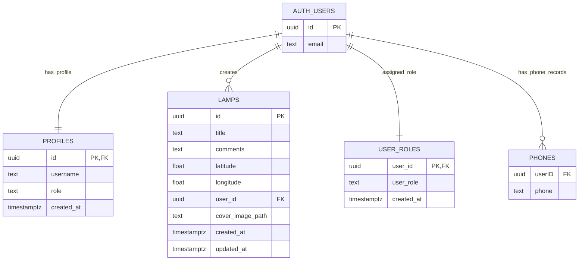

# Database Schema Design

## Overview
The application uses Supabase Postgres with SQL migrations in `supabase/migrations`.

Main data domains:

- User identity (managed by `auth.users`)
- App profile/role data (`public.profiles`, `public.user_roles`)
- Lamp reports (`public.lamps`)
- Optional user phone data (`public.phones`)
- Report image files (Supabase Storage bucket `lamp-report-images`)

## Main Tables

### `auth.users` (Supabase managed)
Primary authentication table managed by Supabase.

Key field:
- `id` (UUID, PK)

### `public.profiles`
Per-user application profile.

Columns:
- `id` UUID PK, FK -> `auth.users.id`
- `username` text NOT NULL
- `role` enum (`visitor`, `user`, `admin`) NOT NULL, default `user`
- `created_at` timestamptz NOT NULL, default `now()`

### `public.lamps`
Lamp report records shown on the map/table.

Columns:
- `id` UUID PK
- `title` text NOT NULL
- `comments` text NULL
- `latitude` double precision NOT NULL
- `longitude` double precision NOT NULL
- `user_id` UUID NOT NULL, FK -> `auth.users.id`
- `cover_image_path` text NULL
- `created_at` timestamptz NOT NULL
- `updated_at` timestamptz NOT NULL

### `public.user_roles`
Role source used by `is_admin()` helper for policy checks.

Columns:
- `user_id` UUID PK, FK -> `auth.users.id`
- `user_role` enum (`user`, `admin`) NOT NULL, default `user`
- `created_at` timestamptz NOT NULL, default `now()`

### `public.phones`
Optional phone records for users (used by admin flows).

Columns:
- `userID` UUID NOT NULL, FK -> `auth.users.id`
- `phone` text NOT NULL

## Relationships

## Security and Policies (RLS)

- `profiles`
  - Select: public (anon + authenticated)
  - Update: owner or admin
- `lamps`
  - Select: public (anon + authenticated)
  - Insert: authenticated owner (`auth.uid() = user_id`)
  - Update/Delete: owner or admin
- `user_roles`
  - Select: public
  - Insert/Update/Delete: admin-only

## Triggers and Functions

- `set_updated_at()`: maintains `updated_at` timestamps on updates.
- `handle_new_user()`: inserts/updates profile row on auth user creation.
- `is_admin()`: checks whether current user has admin role in `user_roles`.

## Storage

Bucket: `lamp-report-images`

- Public read for images.
- Authenticated users can upload/update/delete only their own folder-scoped files.
- Image path is stored in `lamps.cover_image_path`.
